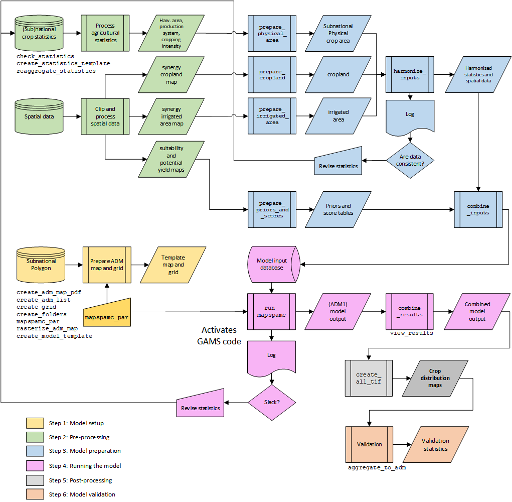

```{r, include = FALSE}
knitr::opts_chunk$set(
  collapse = TRUE,
  comment = "#>"
)
```

The `mapspamc` package includes functions to facilitate all six major steps to create crop distribution maps, including (1) model setup, (2) pre-processing, (3) model preparation, (4) running the model, (5) post-processing and (6) model validation. The figure below presents a flow chart with all six steps, interconnections and key functions. Each step is discussed in a separate vignette.

```{r fig-flowchart, echo=FALSE, error=FALSE, fig.cap="Six main steps to create crop distribution maps with `mapspamc` Functions printed inside flow chart shapes implement key model steps, while functions printed outside have auxiliary purposes", fig.align="center", out.width="80%"}

```
