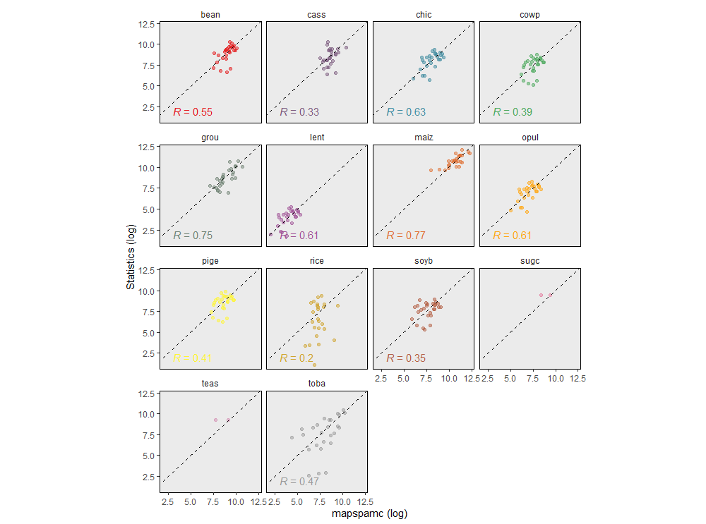
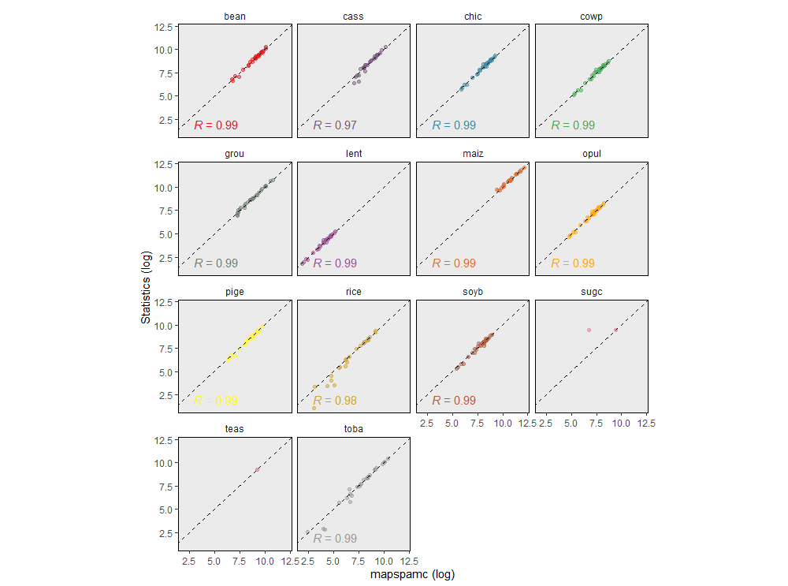

```{r, include = FALSE}
knitr::opts_chunk$set(
  collapse = TRUE,
  comment = "#>"
)
```

Technical validation of a model is important to check whether it is reliable and can produce credible results [@VanVliet2016]. The most common approach to evaluate a model is to compare model outcomes with actual observations. This approach is not easy in case of `mapspamc` as all (subnational) crop statistics are used as input by the model. Previous studies have compared SPAM output with level 3 administrative unit statistics [@You2006] and satellite imagery [@Joglekar2019] but such data is often not available, in particularly for developing countries. As an alternative, @Yu2020 proposed an approach in which the model is run with level 1 administrative unit constraints only (i.e. level 2 subnational information is not used as input) after which the results are compared with the available level 2 administrative unit statistics. The reasoning for this is that if the model is able to adequately predict the location of crops using coarse administrative-unit constraints, similar performance can be expected when additional fine-grained subnational statistics are used to constrain the model. 

The folder `06_model_validation` contains scripts that implement the validation approach used by @Yu2020. In `01_alternative_model_setup.R`, the parameters are set to solve the model using level 1 subnational information only. By default the same parameters are used as set for the main model (e.g. `min_entropy` or `max_score`, `year` and `res`). The only difference is that `adm_level` is set to 1. Note that if only level 1 administrative unit statistics are available, the models will be the same and there is no added value in running the validation scripts. 

There is no need for the user to adjust the parameters in `01_alternative_model_setup.R`. This script is sourced when implementing `02_prepare_and_run_alternative_model.R`, which runs the alternative model, which is used as benchmark for the validation. As the input data is the same as for the main model, all data pre-processing steps will be skipped. 

After the alternative model is completed, the user can run `03_model_validation.R`, which compares the results of the alternative model with level 2  subnational statistics. In the first part of the script the grid-level harvested area results are aggregated to derive level 2 administrative unit totals.

```{r, eval=FALSE}
# Aggregate gridded output to adm level of model specified by param
results_alt_ag <- aggregate_to_adm(param, alt_param) %>%
  mutate(source = "model")
```

In the remainder of the script, the model output is compared with the subnational crop statistics. The figure below shows the results for the Malawi `min_entropy`. For 14 out 29 crops level 2 administrative unit statistics are available (but note that for teas and sugc, there are only a few observations, which makes statistical comparison impossible). The predictions are relatively good for maize (R^2^=0.77) and groundnuts (R^2^=0.75), while a poor fit was found for rice (R^2^=0.2) and cassava (R^2^=0.33). The values for the crops with the best fit are comparable to those presented by @Yu2020, who reported an R^2^ of 0.66-0.94 for maize, cotton and rice in Brazil.

```{r fig-validation1, echo=FALSE, error=FALSE, fig.cap="Comparison of level 1 administrative unit constrained model aggregated to level 2 with subnational statistics for the min_entropy model", fig.align="center", out.width="80%"}

```

Another approach to validate the model is to compare the subnational statistics with subnational aggregated results of the main model. There should be near perfect correlation between both datasets as the model uses the subnational statistics as a constraint to allocate crop area. Slight deviations are the result of slack, which is added to the model to allow for some flexibility and prevents the model from becoming infeasible (see [Appendix](appendix.html)).

```{r fig-validation2, echo=FALSE, error=FALSE, fig.cap="Comparison of level 2 administrative unit constrained model results aggregated to level 2 with subnational statistics for the min_entropy model", fig.align="center", out.width="80%"}

```


## References

